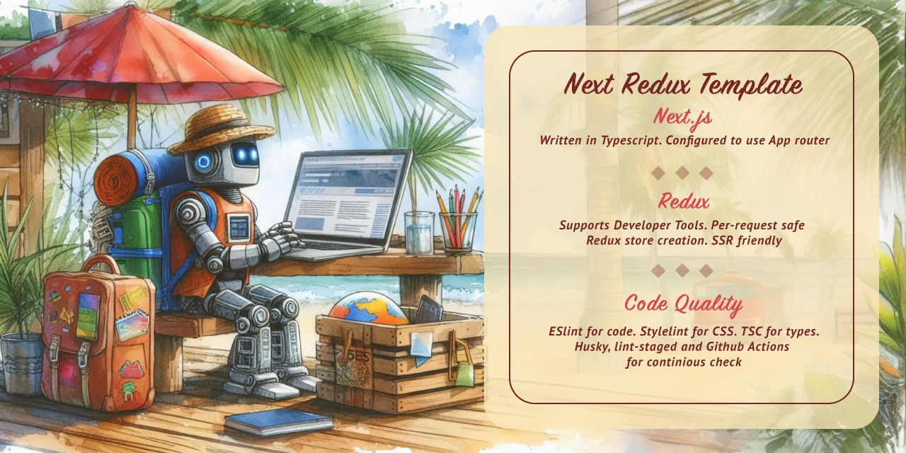

[](https://github.com/morewings/ts-redux-next/actions/workflows/pages.yml)
[](https://github.com/morewings/ts-redux-next/actions/workflows/merge-jobs.yml)
[](https://vercel.com/dima-vyshniakovs-projects/ts-redux-next)

# Redux enabled Next template

[](#)

This template is for Next based web applications using Redux store and App Router configuration. This template has tests for React components, reducers, hooks. There is a basic Promise resolver middleware example.

Static html deployment: [Github pages](https://morewings.github.io/ts-redux-next/)

Full-featured deployment: [Vercel](https://ts-redux-next.vercel.app/)

## Features

- Written **Typescript**.
- Powered by **Nextjs**.
- Configured to use **App router**.
- **Redux** with DevTools support.
- Promise resolving Redux **middleware example**.
- **Generate** components and features from CLI.
- **pnpm** for fast package management.
- **Husky** for git hooks.
- **Eslint** and **stylelint**.
- **Jest** and **react-testing-library** for testing.
- Supports **CSS Modules** and **Styled components**.

## Quickstart

### Prerequisites

1. Install **Node** >= 20.x.
2. Install **pnpm**. E.g. `corepack prepare pnpm@latest --activate`.


### Installation

Manually clone repo or use `degit`.

```shell script
# With CSS Modules config
npx degit github:morewings/ts-redux-next my-app
# With Styled Components config
npx degit github:morewings/ts-redux-next#styled-components my-app
cd ./my-app
pnpm i
```

## Generate components and features

Template uses [generate-react-cli](https://www.npmjs.com/package/generate-react-cli). Templates are located at `./templates` folder.

```shell script
pnpm run generate:component Foo
```

Creates all necessary React component files in `./src/components/Foo`. 

```shell script
pnpm run generate:component-loading Foo
```

Creates React component files for component with dynamically loading content in `./src/components/Foo`. 

```shell script
pnpm run generate:feature Foo
```

Creates reducer, React hooks accessing global state and selectors inside in `./src/features/Foo`. 

```shell script
pnpm run generate:page Foo
```

Creates Next App router compatible page in `./app/Foo` folder.

## Enable Styled components

You can find all changes inside this [PR](https://github.com/morewings/ts-redux-next/pull/40) and [styled-components](https://github.com/morewings/ts-redux-next/tree/styled-components) branch.

## Previous implementations

[cra-template-quickstart-redux](https://github.com/morewings/cra-template-quickstart-redux)

[react-template](https://github.com/morewings/react-template)

